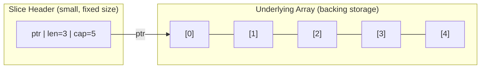

<div align="center">
  <h1>Slices</h1>
  <small>
    <strong>Author:</strong> Nguyễn Tấn Phát
  </small> <br />
  <sub>September 18, 2026</sub>
</div>

## Table of Contents

1. [What Is a Slice?](#1-what-is-a-slice)
2. [The Slice Header: Pointer, Length, Capacity](#2-the-slice-header-pointer-length-capacity)
3. [Creating Slices](#3-creating-slices)
4. [Nil Slices vs. Empty Slices](#4-nil-slices-vs-empty-slices)
5. [Length vs. Capacity](#5-length-vs-capacity)
6. [Slicing a Slice](#6-slicing-a-slice)
7. [Slicing Shares the Underlying Array](#7-slicing-shares-the-underlying-array)
8. [The Three-Index Slice Expression](#8-the-three-index-slice-expression)
9. [The `append` Function](#9-the-append-function)
10. [How `append` Decides to Grow](#10-how-append-decides-to-grow)
11. [The `append`-Aliasing Surprise](#11-the-append-aliasing-surprise)
12. [The `copy` Function](#12-the-copy-function)
13. [Passing Slices to Functions](#13-passing-slices-to-functions)
14. [Iterating Over a Slice](#14-iterating-over-a-slice)
15. [Multidimensional Slices](#15-multidimensional-slices)
16. [Removing Elements from a Slice](#16-removing-elements-from-a-slice)
17. [Slices Are Not Comparable (Except to `nil`)](#17-slices-are-not-comparable-except-to-nil)
18. [Memory Retention: Slicing Can Leak a Large Backing Array](#18-memory-retention-slicing-can-leak-a-large-backing-array)
19. [The Standard Library's `slices` Package](#19-the-standard-librarys-slices-package)
20. [Common Mistakes and Pitfalls](#20-common-mistakes-and-pitfalls)
21. [Best Practices Summary](#21-best-practices-summary)
22. [Use Case Summary Table](#22-use-case-summary-table)
23. [References](#23-references)

## 1. What Is a Slice?

A **slice** is Go's primary, everyday tool for representing a sequence of elements whose length can grow and shrink at runtime. Unlike a fixed-size array, a slice's type carries no length information at all — `[]int` is a single type, regardless of how many elements a particular slice value currently holds.

```go
var numbers []int // a nil slice of int, ready to be grown
numbers = append(numbers, 1, 2, 3)
fmt.Println(numbers) // [1 2 3]
```

Conceptually, a slice is a **view** — or window — over a contiguous run of elements stored in an underlying array. Slices are not a container that owns its data outright; they're a lightweight descriptor pointing at data that may also be visible through other slices.

## 2. The Slice Header: Pointer, Length, Capacity

Internally, a slice value is a small, fixed-size struct (often called the "slice header") containing three fields:

```go
// Conceptual representation — not literally how the runtime source names it, but structurally accurate
type sliceHeader struct {
    ptr *ElementType // pointer to the first element the slice can see, within the underlying array
    len int           // number of elements currently accessible through this slice
    cap int           // number of elements available from ptr to the end of the underlying array
}
```



Because a slice's header is small and fixed-size (a pointer plus two integers) regardless of how many elements the slice logically holds, passing a slice around — as a function argument, in an assignment — is always cheap: only this small header is copied, never the underlying elements themselves. This is the key mechanical fact that explains almost everything distinctive about how slices behave, covered throughout this guide.

## 3. Creating Slices

### 3.1 Slice Literal

```go
fruits := []string{"apple", "banana", "cherry"}
```

A slice literal looks like an array literal but omits the length — Go allocates a backing array of exactly the right size and creates a slice over the whole thing.

### 3.2 `make`

```go
s := make([]int, 5)      // length 5, capacity 5, all elements zero-valued
s2 := make([]int, 3, 10) // length 3, capacity 10 — 7 "extra" slots available for future append calls
```

`make` is the standard way to create a slice with a specific starting length and, optionally, extra capacity reserved up front for efficient future growth (see [Section 10](#10-how-append-decides-to-grow)).

### 3.3 Slicing an Existing Array or Slice

```go
arr := [5]int{1, 2, 3, 4, 5}
s := arr[1:4] // a slice view over indices 1, 2, 3 of arr — [2 3 4]
```

Covered in depth in [Section 6](#6-slicing-a-slice).

## 4. Nil Slices vs. Empty Slices

A `nil` slice and a non-nil, zero-length slice are subtly different, though they behave almost identically in most everyday code:

```go
var s1 []int          // nil slice: ptr is nil, len is 0, cap is 0
s2 := []int{}          // non-nil, empty slice: ptr points to a valid (zero-sized) location, len is 0, cap is 0

fmt.Println(s1 == nil) // true
fmt.Println(s2 == nil) // false

fmt.Println(len(s1), len(s2)) // 0 0 — both report zero length
```

**Unlike a `nil` map**, a `nil` slice is perfectly safe to append to, iterate over, and use with `len`/`cap` — `append` on a `nil` slice simply allocates a fresh backing array on the first call, exactly as it would for any other slice that needs to grow:

```go
var s []int   // nil
s = append(s, 1) // works fine — no panic, unlike a nil map's write
fmt.Println(s)    // [1]
```

**When the distinction matters:** primarily in JSON marshaling (`encoding/json` encodes a `nil` slice as `null`, but an empty, non-nil slice as `[]`) and in code that explicitly checks `== nil` to distinguish "never initialized" from "initialized but currently empty." For most other purposes, treat both the same way and prefer checking `len(s) == 0` over `s == nil` when you just want to know "is this slice empty," since that check works correctly regardless of which of the two you actually have.

## 5. Length vs. Capacity

- **Length** (`len(s)`) is the number of elements currently accessible through the slice — this is what `for range` iterates over, and what indexing (`s[i]`) is bounds-checked against.
- **Capacity** (`cap(s)`) is the number of elements available in the underlying array starting from the slice's first element — i.e., how far the slice could grow via re-slicing or `append` before a brand-new backing array would need to be allocated.

```go
s := make([]int, 3, 5) // len=3, cap=5
fmt.Println(len(s), cap(s)) // 3 5

s = append(s, 99) // fits within the existing capacity — no reallocation needed
fmt.Println(len(s), cap(s)) // 4 5
```

A slice **can never be indexed or grown-by-reslicing beyond its capacity** — attempting to do so panics, just like an out-of-bounds array access:

```go
s := make([]int, 3, 5)
// _ = s[10]     // panic: index out of range
// s = s[:10]    // panic: slice bounds out of range [:10] with capacity 5
```

## 6. Slicing a Slice

The slice expression `s[low:high]` produces a new slice header covering elements from index `low` (inclusive) up to, but not including, index `high` (exclusive):

```go
s := []int{0, 1, 2, 3, 4, 5}

fmt.Println(s[1:4]) // [1 2 3] — indices 1, 2, 3
fmt.Println(s[:3])   // [0 1 2] — low defaults to 0
fmt.Println(s[3:])   // [3 4 5] — high defaults to len(s)
fmt.Println(s[:])     // [0 1 2 3 4 5] — the whole slice
```

Crucially, this operation is **cheap and instantaneous** — it does not copy any element data. It simply computes a new header (a new pointer offset into the same underlying array, plus a new length and capacity) and returns that.

A resliced slice can be grown back up to (but not beyond) the original slice's capacity, even past its own current length:

```go
s := make([]int, 2, 5) // len=2, cap=5
short := s[:1]           // len=1, cap=4 (capacity counts from short's own start position)
grown := s[:cap(s)]       // len=5, cap=5 — grown back out to the full original capacity
```

## 7. Slicing Shares the Underlying Array

Because slicing doesn't copy data, a slice produced from another slice (or from an array) **shares the exact same underlying storage** — modifying an element through one slice is visible through any other slice that also covers that same element:

```go
d := []byte{'r', 'o', 'a', 'd'}
e := d[2:] // e shares d's underlying array, viewing indices 2 and 3

e[1] = 'm'
fmt.Println(e) // [a m] → "am"
fmt.Println(d) // [r o a m] → "roam" — d was mutated through e!
```

This is a deliberate and important property, not a bug — it's what makes slicing efficient, and it's frequently useful (passing a sub-view of a large buffer to a parsing function without copying it, for example). But it also means two slices that appear independent may in fact be silently aliased to the same memory, which is a common source of surprising bugs when the sharing isn't intended — see [Section 11](#11-the-append-aliasing-surprise) for the specific, especially confusing case involving `append`.

## 8. The Three-Index Slice Expression

A slice expression can optionally take a **third index** to explicitly cap the resulting slice's capacity, independent of how far the underlying array actually extends: `s[low:high:max]`. The resulting slice has length `high - low` and capacity `max - low`.

```go
arr := []int{1, 34, 5, 6, 6, 7, 22, 1235}
s := arr[1:4:5]

fmt.Println(len(s)) // 3   (4 - 1)
fmt.Println(cap(s))  // 4   (5 - 1)
fmt.Println(s)        // [34 5 6]
```

Without the third index, a slice's capacity always extends all the way to the end of its underlying array. With it, you're deliberately limiting how far the resulting slice can grow via `append` before a reallocation is forced — see the next two sections for exactly why this matters.

## 9. The `append` Function

`append` adds one or more elements to the end of a slice, returning a (possibly, but not always, new) slice reflecting the addition:

```go
s := []int{1, 2, 3}
s = append(s, 4)          // append a single element
s = append(s, 5, 6, 7)     // append multiple elements
s = append(s, otherSlice...) // append all elements of another slice, using the spread operator
```

**Critical rule: always assign `append`'s result back**, typically to the same variable. `append` may or may not allocate a new backing array depending on available capacity (see the next two sections) — if it does, the old slice variable, left unassigned, would keep pointing at stale, disconnected data:

```go
s := []int{1, 2, 3}
append(s, 4) // BUG: result discarded — s is left unchanged, and the appended value is lost
```

## 10. How `append` Decides to Grow

`append` first checks whether the slice's existing backing array has enough spare capacity to hold the new total length:

- **If there's room** (`len(s) + number of new elements <= cap(s)`): the new elements are written directly into the existing backing array, right after the current elements, and the returned slice simply has an updated length — no new memory is allocated, and the returned slice's `ptr` is unchanged.
- **If there isn't room**: `append` allocates a **brand-new, larger backing array**, copies every existing element from the old array into the new one, then adds the new elements — the returned slice's `ptr` now points to this entirely new array, completely disconnected from the original.

```go
s := make([]int, 0, 1)
s = append(s, 1) // fits within cap=1 — no growth
s = append(s, 2) // capacity exceeded — Go allocates a new, larger backing array
```

### 10.1 The Growth Factor

When Go's runtime does need to allocate a larger backing array, it doesn't simply allocate exactly the additional space needed — it applies a growth strategy designed to keep the _amortized_ cost of repeated appends low, roughly doubling capacity for smaller slices and using a more conservative growth factor (closer to 1.25x) once a slice's capacity climbs past a few hundred elements, to avoid wasting excessive memory on very large slices. The exact thresholds and factors are runtime implementation details that can change between Go versions, so code should never depend on a specific resulting capacity after growth — only that it will be at least large enough to hold the new elements.

```go
s := make([]int, 0, 1)
s = append(s, 1, 2, 3) // needs capacity >= 3; doubling 1 -> 2 isn't enough, so the runtime grows to at least 3
fmt.Println(cap(s))     // exact value depends on the Go version's growth algorithm — don't hardcode an assumption about it
```

**Practical takeaway:** if you know approximately how many elements a slice will eventually hold, pre-allocate that capacity up front with `make([]T, 0, expectedSize)` — this avoids the overhead of multiple incremental reallocate-and-copy cycles that would otherwise happen as the slice grows organically one `append` call at a time.

## 11. The `append`-Aliasing Surprise

This is one of the most well-known and genuinely surprising Go slice pitfalls, and it follows directly from the two mechanical facts already covered: slicing shares an underlying array ([Section 7](#7-slicing-shares-the-underlying-array)), and `append` only allocates a new array when the existing capacity is exhausted ([Section 10](#10-how-append-decides-to-grow)).

```go
arr := []int{1, 34, 5, 6, 6, 7, 22, 1235}
s := arr[1:4] // len=3, cap=7 (capacity extends to the end of arr's backing storage)

s = append(s, 99) // fits within cap=7 — writes directly into arr's backing array at index 4!

fmt.Println(arr) // [1 34 5 6 99 7 22 1235] — arr[4] was silently overwritten, even though we only touched s!
```

Because `s` had spare capacity (inherited from slicing `arr`, whose capacity extends past what `s`'s own length uses), appending to `s` wrote directly into `arr`'s backing array at a position `s` didn't originally "occupy" by length — silently clobbering data that another part of the program (holding a reference to `arr`) might still be relying on.

**The fix — the three-index slice expression:** deliberately capping a slice's capacity to exactly its current length forces any subsequent `append` beyond that length to allocate a fresh array instead of writing into shared memory:

```go
arr := []int{1, 34, 5, 6, 6, 7, 22, 1235}
s := arr[1:4:4] // len=3, cap=3 (capped explicitly) — no spare room left to silently write into

s = append(s, 99) // capacity exceeded (3 -> 4) — forces a NEW allocation instead of touching arr

fmt.Println(arr) // [1 34 5 6 6 7 22 1235] — unchanged!
fmt.Println(s)    // [34 5 6 99] — now backed by its own, independent array
```

This is precisely why the three-index slice expression exists, and it's worth reaching for deliberately whenever you hand out a sub-slice of a larger slice/array to code that might append to it, and you don't want that code's appends to potentially corrupt the original data.

## 12. The `copy` Function

`copy(dst, src)` copies elements from `src` into `dst`, up to the length of whichever of the two is shorter, and returns the number of elements actually copied. Unlike slicing, `copy` genuinely duplicates element data into `dst`'s own backing storage — the two slices are independent afterward.

```go
src := []int{1, 2, 3}
dst := make([]int, 3)

n := copy(dst, src)
fmt.Println(n, dst) // 3 [1 2 3]

dst[0] = 999
fmt.Println(src) // [1 2 3] — unaffected; dst has its own storage
```

**Use case:** producing a genuinely independent copy of a slice's data (rather than a shared view), or copying data between two overlapping regions of the _same_ underlying array (which `copy` handles correctly even when the source and destination ranges overlap, unlike a naive element-by-element loop might if written carelessly).

```go
// A common idiom: making a fully independent copy of a slice
original := []int{1, 2, 3}
duplicate := make([]int, len(original))
copy(duplicate, original)
```

## 13. Passing Slices to Functions

Because a slice's header is small and copied by value (per [Section 2](#2-the-slice-header-pointer-length-capacity)), passing a slice to a function is always cheap, regardless of how many elements it logically contains — only the header (pointer, length, capacity) is copied, not the underlying elements.

```go
func double(s []int) {
    for i := range s {
        s[i] *= 2 // mutates the shared underlying array — visible to the caller
    }
}

nums := []int{1, 2, 3}
double(nums)
fmt.Println(nums) // [2 4 6] — the caller sees the change
```

**However, `append` inside a function can silently fail to affect the caller**, if it happens to trigger a reallocation — since the function's local slice variable would then point at a brand-new array the caller's own slice variable never finds out about:

```go
func addOne(s []int) {
    s = append(s, 1) // if this reallocates, the caller's slice variable is untouched
}

nums := make([]int, 3, 3) // len=3, cap=3 — no spare room
addOne(nums)
fmt.Println(nums) // [0 0 0] — unchanged; addOne's append had to reallocate, and the caller never sees the new slice
```

If a function needs to reliably grow a caller's slice, it must **return** the new slice and have the caller reassign it, exactly like the top-level `append` idiom itself:

```go
func addOne(s []int) []int {
    return append(s, 1)
}

nums = addOne(nums) // caller must capture and reassign the result
```

## 14. Iterating Over a Slice

```go
fruits := []string{"apple", "banana", "cherry"}

for i, fruit := range fruits {
    fmt.Println(i, fruit)
}

for _, fruit := range fruits { // values only
    fmt.Println(fruit)
}

for i := range fruits { // indices only
    fmt.Println(i)
}
```

As with arrays, the value obtained from `range` is a **copy** of each element — mutating it doesn't affect the slice's underlying array. To mutate elements in place during iteration, index back into the slice explicitly:

```go
for i := range fruits {
    fruits[i] = strings.ToUpper(fruits[i]) // this DOES modify the underlying array
}
```

## 15. Multidimensional Slices

Go builds multidimensional, grid-like dynamic structures as slices of slices — unlike a multidimensional array, each inner slice is an independent slice value with its own length and capacity, so rows can even have different lengths (a "ragged" or "jagged" structure):

```go
grid := make([][]int, 3) // 3 rows, each currently a nil slice
for i := range grid {
    grid[i] = make([]int, 4) // each row independently allocated with 4 columns
}

grid[1][2] = 5

for _, row := range grid {
    fmt.Println(row)
}
```

**Important:** creating the outer slice does **not** automatically allocate the inner slices — each inner slice starts as its own independent `nil` slice until explicitly created, exactly the same principle as nested maps requiring their inner maps to be initialized separately.

## 16. Removing Elements from a Slice

Go has no built-in "remove element" function for slices — removal is done manually, typically with `append` or by explicitly shifting elements.

### 16.1 Remove, Preserving Order

```go
func removeAt(s []int, index int) []int {
    return append(s[:index], s[index+1:]...)
}
```

This shifts every element after `index` one position to the left, preserving the relative order of the remaining elements. Note that this mutates the underlying array in place (per the aliasing behavior from [Section 7](#7-slicing-shares-the-underlying-array)) — any other slice sharing that same backing array will observe the shift too.

### 16.2 Remove, Without Preserving Order (Faster)

When element order doesn't matter, swapping the element to remove with the last element and truncating is a common, faster alternative that avoids shifting every subsequent element:

```go
func removeUnordered(s []int, index int) []int {
    s[index] = s[len(s)-1]
    return s[:len(s)-1]
}
```

## 17. Slices Are Not Comparable (Except to `nil`)

Just as with maps, Go does not allow comparing two slices with `==` — the only valid comparison for a slice is against `nil`:

```go
a := []int{1, 2, 3}
b := []int{1, 2, 3}

// fmt.Println(a == b) // COMPILE ERROR: slice can only be compared to nil

fmt.Println(a == nil) // false
```

This restriction also means a slice type cannot be used as a map key, and a struct containing a slice field is itself not comparable with `==` (see the discussion of struct comparability elsewhere for the general rule). To compare two slices' contents, use `reflect.DeepEqual` or the standard library's `slices.Equal` function (Go 1.21+), which is both clearer in intent and generally faster than `reflect.DeepEqual` for this specific purpose:

```go
import "slices"

fmt.Println(slices.Equal(a, b)) // true
```

## 18. Memory Retention: Slicing Can Leak a Large Backing Array

Because a sub-slice shares its parent's entire underlying array, holding onto even a small sub-slice of a very large slice keeps the **entire original backing array** alive in memory — the garbage collector cannot reclaim any of it as long as any slice still references any part of it.

```go
func loadHugeFileAndExtractHeader(path string) []byte {
    data := loadEntireFile(path) // e.g., a 500MB byte slice
    header := data[:16]           // just the first 16 bytes — but shares data's ENTIRE backing array!
    return header                  // the caller now unintentionally keeps all 500MB alive
}
```

If only a small piece of a large slice is genuinely needed long-term, explicitly copy that piece into its own, independent, appropriately-sized slice, so the large original backing array can actually be garbage collected once nothing else references it:

```go
func loadHugeFileAndExtractHeader(path string) []byte {
    data := loadEntireFile(path)
    header := make([]byte, 16)
    copy(header, data[:16]) // genuinely independent copy — data can now be freed
    return header
}
```

## 19. The Standard Library's `slices` Package

Go 1.21 introduced the `slices` package, providing common generic operations over slices so they don't need to be hand-written for every element type:

```go
import "slices"

nums := []int{5, 2, 8, 1}

slices.Sort(nums)                       // [1 2 5 8]
fmt.Println(slices.Contains(nums, 8))    // true
fmt.Println(slices.Index(nums, 5))       // 2
reversed := slices.Clone(nums)
slices.Reverse(reversed)                  // [8 5 2 1]
fmt.Println(slices.Equal(nums, reversed)) // false
compacted := slices.Compact([]int{1, 1, 2, 2, 3}) // [1 2 3] — removes CONSECUTIVE duplicates
```

**Practical takeaway:** before hand-writing a loop to search, sort, compare, clone, or deduplicate a slice, check whether the `slices` package (Go 1.21+) already provides it — these are maintained as part of the standard library and are generally well-optimized and thoroughly tested.

## 20. Common Mistakes and Pitfalls

### 20.1 Discarding `append`'s Result

```go
s := []int{1, 2, 3}
append(s, 4) // BUG: result thrown away; s is unchanged
```

Always assign `append`'s return value back — see [Section 9](#9-the-append-function).

### 20.2 Assuming `append` Inside a Function Always Affects the Caller

```go
func addItem(s []int, item int) {
    s = append(s, item) // may or may not reach the caller, depending on remaining capacity
}
```

Return the modified slice and have the caller reassign it — see [Section 13](#13-passing-slices-to-functions).

### 20.3 Unexpected Aliasing After `append`

```go
a := make([]int, 3, 5)
b := a[:2]
b = append(b, 99) // fits within a's spare capacity — silently overwrites a[2]!
```

Use the three-index slice expression (`a[:2:2]`) to cap capacity and force a fresh allocation when you don't want a sub-slice's appends to touch the original — see [Section 11](#11-the-append-aliasing-surprise).

### 20.4 Holding a Small Slice That Keeps a Huge Backing Array Alive

Covered in depth in [Section 18](#18-memory-retention-slicing-can-leak-a-large-backing-array) — copy out the small piece you actually need long-term, rather than keeping a sub-slice of something huge.

### 20.5 Comparing Slices with `==`

```go
// if a == b { ... } // COMPILE ERROR
```

Use `reflect.DeepEqual` or `slices.Equal` (Go 1.21+) instead — see [Section 17](#17-slices-are-not-comparable-except-to-nil).

### 20.6 Forgetting Inner Slices Need Independent Initialization

```go
grid := make([][]int, 3)
// grid[0][0] = 1 // PANIC: grid[0] is nil until explicitly allocated
```

Each row of a slice-of-slices must be allocated individually — see [Section 15](#15-multidimensional-slices).

### 20.7 Mutating While Ranging and Expecting the Element to Change

```go
for _, v := range nums {
    v *= 2 // only changes the loop-local copy, not nums itself
}
```

Index back into the slice explicitly (`nums[i] = nums[i] * 2`) to actually mutate elements during iteration — see [Section 14](#14-iterating-over-a-slice).

## 21. Best Practices Summary

1. **Always reassign `append`'s result**, typically to the same variable — never call `append` and discard the return value.
2. **Return a modified slice from a function rather than relying on in-place mutation**, since `append` inside a function may or may not reach the caller depending on capacity.
3. **Pre-allocate capacity with `make([]T, 0, n)` when the eventual size is roughly known**, to avoid repeated reallocate-and-copy cycles during growth.
4. **Use the three-index slice expression (`s[low:high:max]`) whenever you hand out a sub-slice that shouldn't silently alias-write into its parent's backing array via `append`.**
5. **Use `copy` to make a genuinely independent duplicate of a slice's data**, rather than assuming a re-slice gives you independence — it doesn't.
6. **Copy out small pieces you need long-term from a large slice**, rather than holding a sub-slice that keeps the entire large backing array alive.
7. **Prefer `len(s) == 0` over `s == nil`** when you just want to check "is this slice empty," since it behaves correctly regardless of whether the slice is `nil` or simply empty.
8. **Use `reflect.DeepEqual` or the standard library's `slices.Equal`** to compare slice contents, since `==` is not defined for slices beyond comparing to `nil`.
9. **Check the standard library's `slices` package (Go 1.21+)** before hand-writing common operations like sorting, searching, cloning, or deduplicating.
10. **Remember each row of a slice-of-slices needs its own independent allocation** — initializing the outer slice does not cascade to the inner ones.

## 22. Use Case Summary Table

| Technique                               | When to Use                                                                  | Example Scenario                                                               |
| --------------------------------------- | ---------------------------------------------------------------------------- | ------------------------------------------------------------------------------ |
| `make([]T, len, cap)`                   | Known or estimated size upfront, with room to grow efficiently               | Building a slice of results from a query of roughly known size                 |
| Slice literal                           | Small, fixed initial contents known at the call site                         | `[]string{"a", "b", "c"}`                                                      |
| Slicing (`s[low:high]`)                 | A cheap, shared view into an existing slice/array                            | Passing a sub-range of a buffer to a parsing function                          |
| Three-index slicing (`s[low:high:max]`) | Preventing a sub-slice's future `append` calls from aliasing into the parent | Handing out a "read-only-ish" view that shouldn't corrupt the source on append |
| `append`                                | Growing a slice by one or more elements                                      | Accumulating results in a loop                                                 |
| `copy`                                  | A genuinely independent duplicate, or shifting elements within one slice     | Deep-copying a slice, implementing in-place element removal                    |
| `reflect.DeepEqual` / `slices.Equal`    | Comparing slice contents                                                     | Asserting equality in tests                                                    |
| `slices` package (Go 1.21+)             | Sorting, searching, cloning, deduplicating                                   | `slices.Sort`, `slices.Contains`, `slices.Compact`                             |
| Slice of slices                         | A dynamically-sized, possibly ragged multidimensional structure              | A grid where each row can have a different length                              |
| Explicit copy of a small sub-range      | Avoiding retention of a large backing array                                  | Extracting a small header from a very large loaded buffer                      |

## 23. References

1. Go Team — _A Tour of Go: Slices_. https://go.dev/tour/moretypes/7
2. Go Team — _Go Slices: usage and internals_, The Go Blog. https://go.dev/blog/slices-intro
3. Go Language Specification — _Slice types, Slice expressions, Appending to and copying slices_. https://go.dev/ref/spec#Slice_types
4. Go standard library documentation — package `slices`. https://pkg.go.dev/slices
5. Go standard library documentation — package `reflect` (`DeepEqual`). https://pkg.go.dev/reflect
6. Go Team — _Go 1.21 Release Notes_ (`slices` package). https://go.dev/doc/go1.21
7. Educative — _What is the use of slice in Go?_. https://www.educative.io/blog/what-is-the-use-of-slice-in-go
8. Ozan Sazak — _Visual Guide to Slices in Go_. https://sazak.io/articles/visual-guide-to-slices-in-go-2024-03-25
9. Go FAQ (gofaq.org) — _How Slice Internals Work: Length, Capacity, and Underlying Arrays_. https://www.gofaq.org/en/how-slice-internals-work-length-capacity-and-underlying-arrays/
10. themsaid — _Slice Internals in Go: How the Runtime Expands Slices Efficiently_. https://themsaid.com/slice-internals-in-go
11. Tyler Asa — _Shooting Yourself in the Foot with Slices in Go_, DEV Community. https://dev.to/tylerasa/shooting-yourself-in-the-foot-with-slices-in-go-40go
12. OneUptime Engineering Blog — _How to Create Memory-Efficient Slices in Go_. https://oneuptime.com/blog/post/2026-01-30-how-to-create-memory-efficient-slices-in-go/view
13. Abdullah Al Adib Akhand — _Understanding the Inner Workings of How Slices Grow in Golang_, Medium. https://medium.com/@adib08/understanding-the-inner-workings-of-how-slices-grow-in-golang-6e9fb4298caf
