<div align="center">
  <h1>Pointers</h1>
  <small>
    <strong>Author:</strong> Nguyễn Tấn Phát
  </small> <br />
  <sub>September 17, 2026</sub>
</div>

## Table of Contents

1. [What Is a Pointer?](#1-what-is-a-pointer)
2. [The `&` and `*` Operators](#2-the--and--operators)
3. [The Zero Value: `nil`](#3-the-zero-value-nil)
4. [Nil Pointer Dereference](#4-nil-pointer-dereference)
5. [Creating Pointers with `new()`](#5-creating-pointers-with-new)
6. [Pointers to Structs](#6-pointers-to-structs)
7. [Everything in Go Is Passed by Value](#7-everything-in-go-is-passed-by-value)
8. [Why Use Pointers? Mutation Across Function Boundaries](#8-why-use-pointers-mutation-across-function-boundaries)
9. [Pointers vs. Reference Types (Slices, Maps, Channels)](#9-pointers-vs-reference-types-slices-maps-channels)
10. [Stack vs. Heap, and Escape Analysis](#10-stack-vs-heap-and-escape-analysis)
11. [No Pointer Arithmetic](#11-no-pointer-arithmetic)
12. [Pointers to Pointers](#12-pointers-to-pointers)
13. [Pointer Receivers vs. Value Receivers on Methods](#13-pointer-receivers-vs-value-receivers-on-methods)
14. [Comparing Pointers](#14-comparing-pointers)
15. [Pointers and Arrays vs. Slices](#15-pointers-and-arrays-vs-slices)
16. [`new()` vs. `make()`](#16-new-vs-make)
17. [`unsafe.Pointer` (Brief Overview)](#17-unsafepointer-brief-overview)
18. [Common Mistakes and Pitfalls](#18-common-mistakes-and-pitfalls)
19. [Best Practices Summary](#19-best-practices-summary)
20. [Use Case Summary Table](#20-use-case-summary-table)
21. [References](#21-references)

## 1. What Is a Pointer?

A pointer is a variable that stores the **memory address** of another value, rather than the value itself. Instead of holding data directly, a pointer holds a reference to where that data lives in memory.

For a type `T`, the type `*T` denotes "a pointer to a `T` value." Its zero value is `nil`, meaning "points to nothing."

```go
var x int = 42
var p *int = &x // p now holds the memory address of x
```

The diagram below shows the conceptual relationship: `x` is a variable holding the value `42` at some memory address, and `p` is a separate variable that holds _that address_ rather than the value `42` itself.

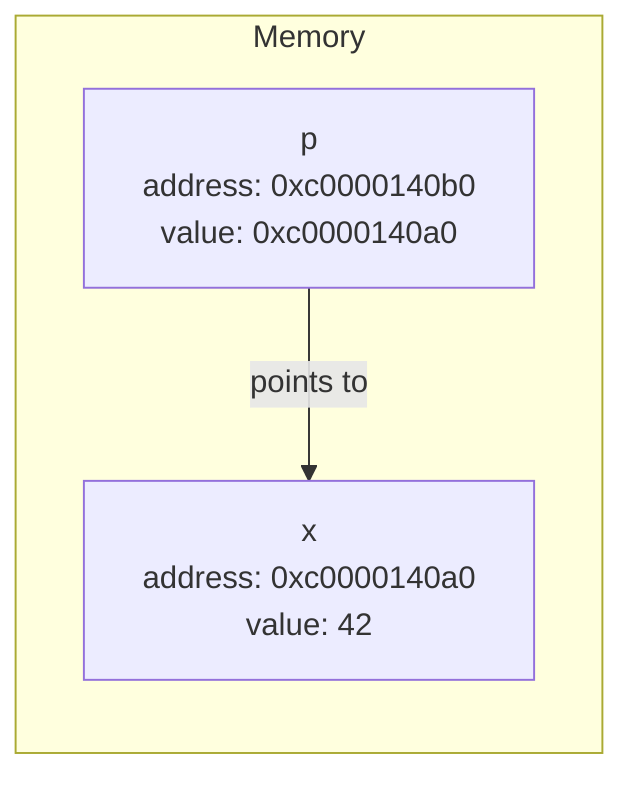

Unlike languages such as C, Go has no pointer arithmetic — you cannot add or subtract from a pointer to "walk" through memory. Go pointers are deliberately restricted to being safe references to a single value, which keeps the language memory-safe and lets the garbage collector reliably track what's still reachable.

## 2. The `&` and `*` Operators

Go uses two operators for working with pointers, and they can initially be confusing because `*` is overloaded (used both in type declarations and as an operator):

| Operator                  | Name                          | Meaning                                                                                       |
| ------------------------- | ----------------------------- | --------------------------------------------------------------------------------------------- |
| `&x`                      | **Address-of**                | Produces a pointer to the operand `x` — "give me the address where `x` lives."                |
| `*p`                      | **Dereference** (indirection) | Produces the value stored at the address `p` points to — "give me the value at this address." |
| `*T` (in a type position) | **Pointer type**              | Declares a variable's type as "pointer to `T`."                                               |

```go
package main

import "fmt"

func main() {
    i := 42
    p := &i // p is a *int, holding the address of i

    fmt.Println(*p) // 21... wait, let's read it correctly:
    fmt.Println(*p) // dereferences p: prints 42

    *p = 21 // dereferences p and assigns through it: sets i to 21
    fmt.Println(i) // 21 — i itself changed, because *p and i are the same memory
}
```

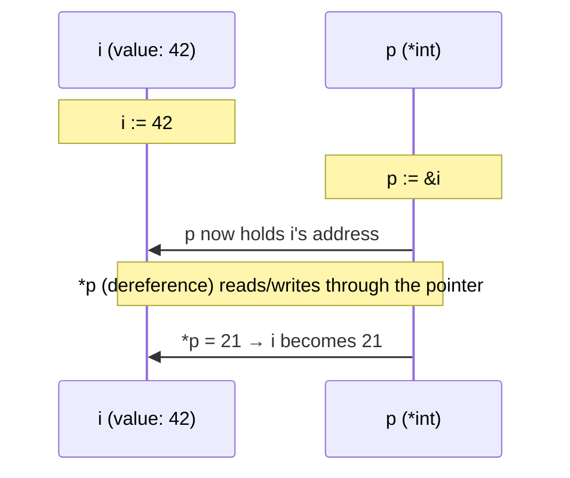

The action of reading or writing a value through a pointer is called **dereferencing** or **indirecting**.

## 3. The Zero Value: `nil`

An uninitialized pointer has the zero value `nil` — it points to nothing at all, not even a "zero" address of a real value:

```go
var p *int
fmt.Println(p)      // <nil>
fmt.Println(p == nil) // true
```

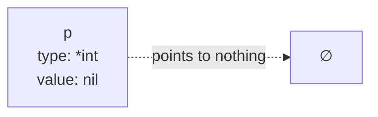

A `nil` pointer is a perfectly valid, common state in Go — for example, an optional field in a struct that "isn't set yet" is often modeled as a pointer that starts out `nil`. The danger is not holding a nil pointer, but _dereferencing_ one, covered next.

## 4. Nil Pointer Dereference

Attempting to dereference (`*p`) a `nil` pointer causes an immediate runtime panic:

```go
var p *int
fmt.Println(*p) // panic: runtime error: invalid memory address or nil pointer dereference
```

This is Go's way of telling you that you tried to follow an address that doesn't actually point to a valid value. Before dereferencing any pointer that might be `nil` (e.g., one returned from a function, or a struct field that's optional), check it explicitly:

```go
func describe(p *int) {
    if p == nil {
        fmt.Println("no value provided")
        return
    }
    fmt.Println("value:", *p)
}
```

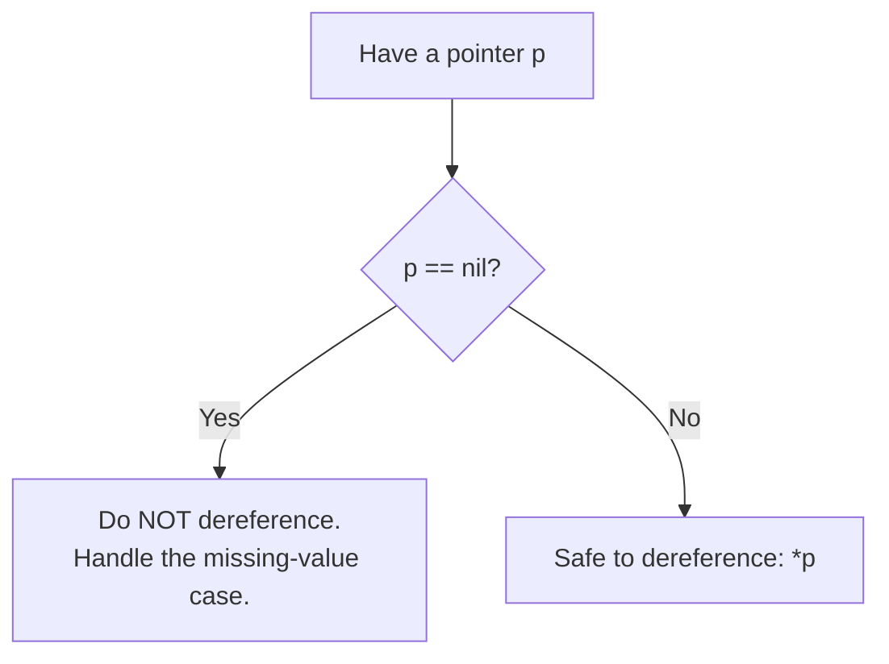

## 5. Creating Pointers with `new()`

`new(T)` is a built-in function that allocates memory for a value of type `T`, zero-initializes it, and returns a pointer to it (`*T`). It's an alternative to `&` when you don't already have a named variable to take the address of:

```go
p := new(int)   // allocates an int, initialized to its zero value (0), returns *int
fmt.Println(*p) // 0

*p = 99
fmt.Println(*p) // 99
```

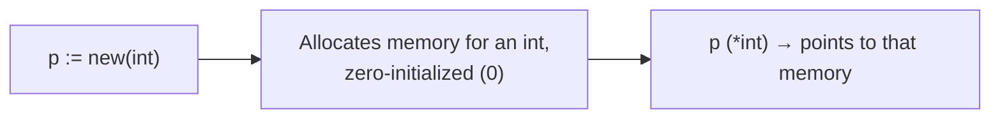

`new(T)` is roughly equivalent to declaring a local variable and taking its address (`v := T{}; p := &v`), just without needing to name the intermediate variable. It is primarily used for allocating a pointer to a zero-valued struct or basic type; it's rarely used for slices, maps, or channels, which use `make()` instead (see [Section 16](#16-new-vs-make)).

## 6. Pointers to Structs

Pointers are extremely common with structs, since structs are often large enough that copying them around by value is wasteful, and because a pointer lets a function mutate the caller's actual struct.

```go
type Person struct {
    Name string
    Age  int
}

func main() {
    person := Person{Name: "Alice", Age: 30}
    ptr := &person // ptr is *Person

    fmt.Println(ptr.Name) // "Alice" — no need to write (*ptr).Name
    ptr.Age = 31           // mutates the original `person` struct through the pointer
    fmt.Println(person.Age) // 31
}
```

Go automatically dereferences a pointer to a struct when you access a field with the dot operator — `ptr.Name` is shorthand for `(*ptr).Name`. You can still write `(*ptr).Name` explicitly if you want, but idiomatic Go always uses the shorter `ptr.Name` form.

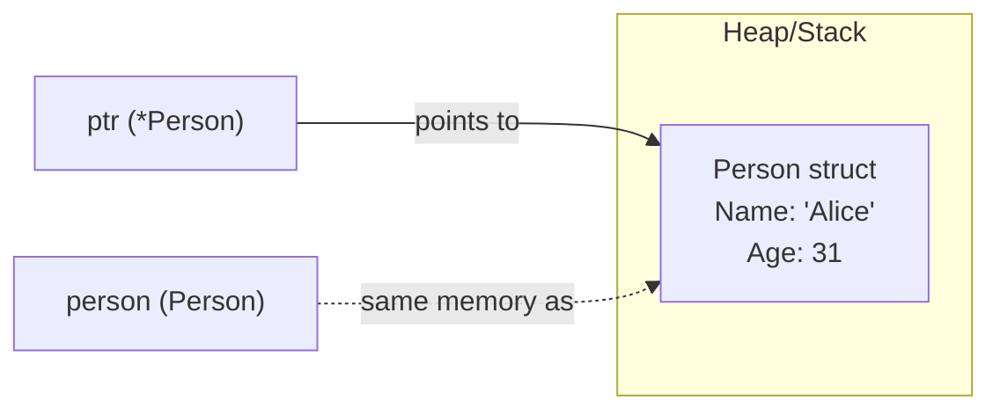

### 6.1 Creating a Struct Pointer Directly

A very common idiom is constructing a struct and taking its address in one expression, often inside a constructor function:

```go
func NewPerson(name string, age int) *Person {
    return &Person{Name: name, Age: age} // address of a struct literal
}

p := NewPerson("Bob", 25)
fmt.Println(p.Name, p.Age) // Bob 25
```

This is safe in Go even though `&Person{...}` looks like it's taking the address of a temporary local value that should disappear when the function returns — the Go compiler's escape analysis (see [Section 10](#10-stack-vs-heap-and-escape-analysis)) automatically places the struct on the heap instead of the stack whenever its address escapes the function, so the returned pointer always remains valid.

## 7. Everything in Go Is Passed by Value

This is one of the most important (and sometimes surprising) facts about Go: **there is no "pass by reference" in the language** — every function argument is a copy. What differs is _what_ gets copied.

```go
func increment(n int) {
    n++ // modifies the local copy only
}

func main() {
    x := 5
    increment(x)
    fmt.Println(x) // still 5 — increment() only changed its own copy
}
```

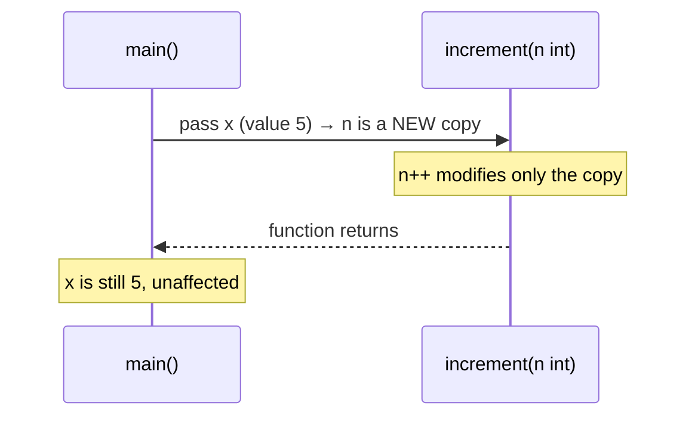

When you pass a **pointer** instead, the thing being copied is the pointer itself (the address) — but since a copy of an address still points to the _same_ underlying value, the callee can modify what's at that address, and the caller will see the change:

```go
func increment(n *int) {
    *n++ // dereferences and modifies the value at the shared address
}

func main() {
    x := 5
    increment(&x)
    fmt.Println(x) // 6 — the value x actually points to was changed
}
```

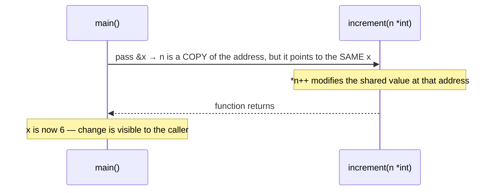

**Key takeaway:** Go doesn't have "pass by reference" as a separate mechanism from "pass by value" — pointers _are_ how you simulate reference-like behavior, by explicitly passing a copy of an address rather than a copy of the underlying data.

## 8. Why Use Pointers? Mutation Across Function Boundaries

Besides simulating "pass by reference," pointers solve two other common problems:

1. **Avoiding expensive copies.** Passing a large struct by value copies every field, every time. Passing a pointer copies only the (small, fixed-size) address, regardless of how large the underlying struct is.
2. **Representing "optional" or "not yet set" values.** A pointer's `nil` zero value naturally distinguishes "no value provided" from "the zero value was explicitly provided" — something a plain value type (e.g., `int`) cannot do, since a plain `int` always has _some_ value (`0` by default), with no built-in way to say "unset."

```go
type Config struct {
    Timeout *int // nil means "not set, use the default"; non-nil means "explicitly configured"
}

func Timeout(c Config) int {
    if c.Timeout == nil {
        return 30 // default
    }
    return *c.Timeout
}
```

## 9. Pointers vs. Reference Types (Slices, Maps, Channels)

Slices, maps, and channels are often called "reference types" in casual Go discussion, because they _internally_ contain a pointer to shared underlying data — but this doesn't mean Go breaks its pass-by-value rule for them. What actually happens is that the small header struct describing them (which does contain a pointer) is what gets copied when passed to a function.

A slice, for example, is internally represented roughly as:

```go
type sliceHeader struct {
    ptr *ElementType // pointer to the underlying array
    len int           // number of elements currently visible
    cap int           // capacity of the underlying array
}
```

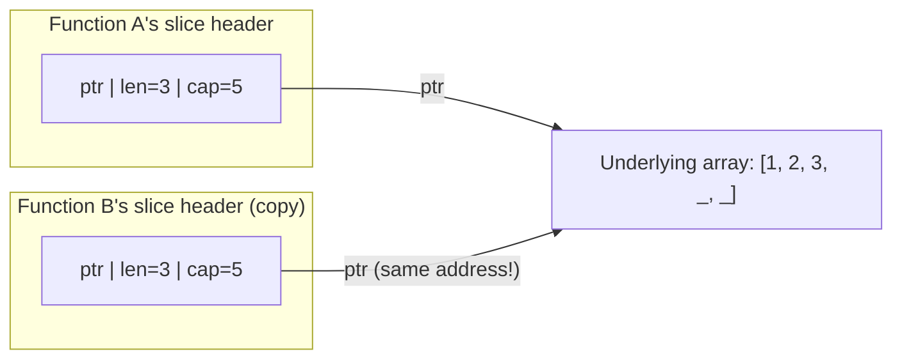

When you pass a slice to a function, Go copies this small header struct (by value, as always), but the `ptr` field inside both copies still points to the **same** underlying array. That's why modifying an _existing element_ of a slice inside a function is visible to the caller, while _appending_ to the slice (which may or may not reallocate a new underlying array) may or may not be visible, depending on whether capacity was exceeded — a frequent source of confusion. Maps and channels work analogously: the variable itself is a small header/descriptor containing a pointer to the actual shared data structure.

**Practical implication:** you rarely need an explicit `*[]T` or `*map[K]V` just to mutate elements in place — the slice/map header's internal pointer already gives you that. An explicit pointer to a slice or map is mainly needed when a function must **reassign** the caller's slice/map variable itself (e.g., `append` growing past capacity and needing to update what the caller's variable refers to), not merely mutate its existing contents.

## 10. Stack vs. Heap, and Escape Analysis

Go has two regions where variables can live in memory:

- **The stack** — a fast, per-goroutine region that works in a strict last-in-first-out order. When a function is called, a stack frame is pushed; when it returns, the frame (and everything in it) is popped and instantly reclaimed, with no garbage-collector involvement needed.
- **The heap** — a larger, shared pool of memory for values that must outlive the function that created them. The garbage collector is responsible for tracking and eventually freeing heap memory once nothing references it anymore.

The Go compiler prefers the stack whenever possible, because it's cheaper and requires no GC bookkeeping. The compiler decides where each variable goes through a compile-time process called **escape analysis**: it determines whether a variable's address could possibly be used after the function that created it returns. If the compiler can prove the variable never "escapes" the function, it stays on the stack; if the compiler can't prove that (or can prove the opposite), the variable **escapes to the heap**.

```go
func noEscape() int {
    y := 100
    return y // y's *value* is copied out; y itself doesn't need to survive — stays on the stack
}

func escapes() *int {
    x := 42
    return &x // the caller keeps a pointer to x, so x must outlive this function — escapes to the heap
}
```

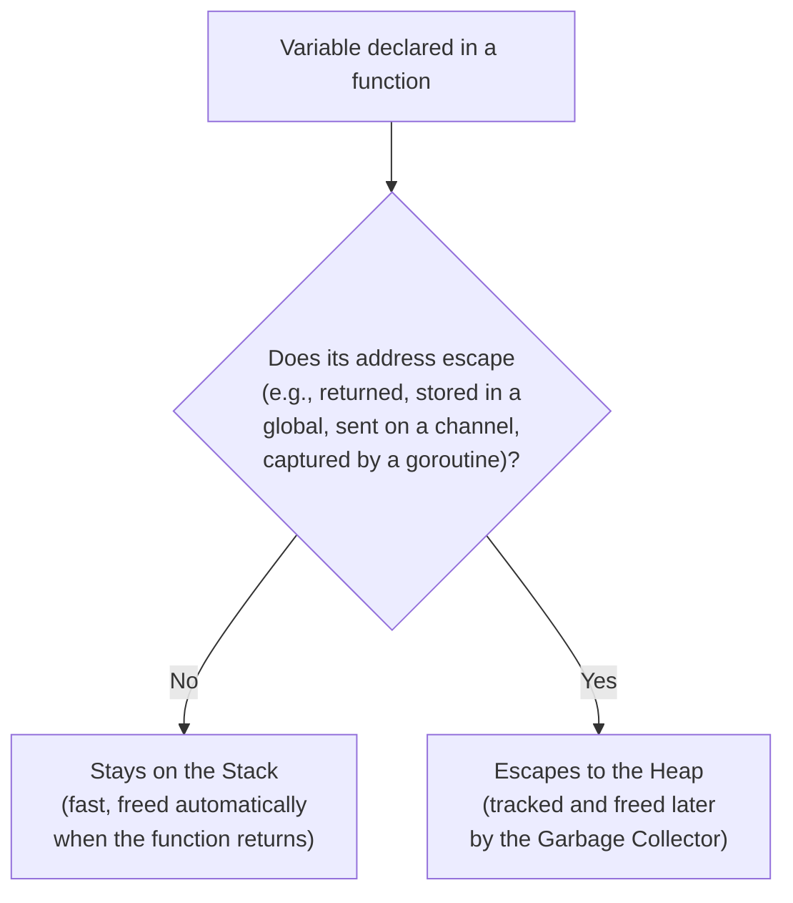

**Why this matters:** returning a pointer to a local variable, which would be a dangerous "dangling pointer" bug in a language like C, is completely safe in Go — the compiler automatically keeps the variable alive on the heap for as long as the pointer to it exists. You never need to manually decide stack vs. heap; escape analysis handles it transparently, and it's generally more a performance-tuning consideration (fewer heap allocations means less GC pressure) than a correctness one.

**Common causes of escaping to the heap**, beyond returning a pointer directly:

- Storing a pointer in a struct field, slice, or map that itself outlives the function.
- A closure (or a goroutine's function literal) capturing a variable by reference.
- Passing a value's address to an interface parameter (since the concrete type and value must be stored somewhere the interface can reference, which can force heap allocation).

You can inspect the compiler's actual escape-analysis decisions with:

```bash
go build -gcflags="-m" ./...
```

which prints diagnostics like `./main.go:4:9: &x escapes to heap` or `./main.go:12:2: y does not escape` for each variable.

## 11. No Pointer Arithmetic

Unlike C/C++, Go deliberately does **not** allow arithmetic on pointers (`p + 1`, `p++`, comparing pointers with `<`/`>`, and so on):

```go
var x int = 10
p := &x
// p++      // COMPILE ERROR — not allowed
// p = p + 1 // COMPILE ERROR — not allowed
```

This restriction is a core part of Go's memory-safety guarantees: since pointers can't be shifted to arbitrary addresses, the language (and its garbage collector) can always be certain about what a pointer legitimately refers to, eliminating an entire category of memory-corruption bugs common in C. If you genuinely need low-level, arithmetic-capable pointer manipulation (for interfacing with C code or doing unsafe optimizations), Go provides an explicit escape hatch in the `unsafe` package (see [Section 17](#17-unsafepointer-brief-overview)) — but its use is rare and discouraged in ordinary application code.

## 12. Pointers to Pointers

A pointer can itself point to another pointer, forming a chain of indirection. This is uncommon in everyday Go code but occasionally shows up (for example, in code that must modify a caller's pointer variable itself, not just what it points to):

```go
func main() {
    x := 10
    p := &x   // *int
    pp := &p  // **int — pointer to a pointer

    fmt.Println(**pp) // dereference twice to reach the int value: 10

    **pp = 20
    fmt.Println(x) // 20
}
```

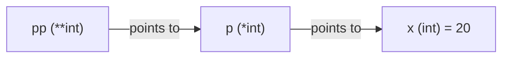

**Use case:** a function that needs to reassign a caller's pointer variable to point somewhere new (not just mutate what it currently points to) takes a `**T` parameter — this pattern is uncommon and usually indicates the API could be redesigned to simply return a new pointer instead, which is almost always clearer.

## 13. Pointer Receivers vs. Value Receivers on Methods

Methods in Go can be defined with either a value receiver or a pointer receiver, and the choice determines whether the method can mutate the caller's original value:

```go
type Counter struct {
    count int
}

// Value receiver: operates on a COPY of the Counter
func (c Counter) IncrementCopy() {
    c.count++ // only changes the local copy
}

// Pointer receiver: operates on the ORIGINAL Counter via its address
func (c *Counter) Increment() {
    c.count++ // changes the actual Counter the pointer refers to
}

func main() {
    c := Counter{}
    c.IncrementCopy()
    fmt.Println(c.count) // 0 — unaffected

    c.Increment() // Go automatically takes &c here since Increment has a pointer receiver
    fmt.Println(c.count) // 1 — actually changed
}
```

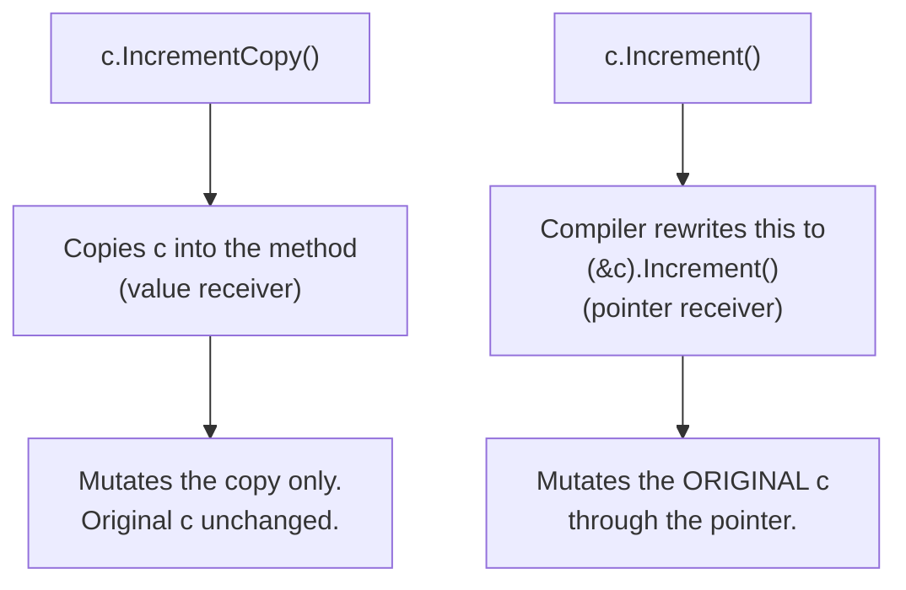

**Guidance:**

- Use a **pointer receiver** when the method needs to mutate the receiver, or when the receiver is a large struct where copying would be wasteful.
- Use a **value receiver** when the method doesn't need to mutate anything and the type is small (basic types, small structs).
- **Be consistent within a type:** if any method on a type needs a pointer receiver, it's conventional to make all of that type's methods use pointer receivers, so the type's full set of behaviors is uniformly accessible however the type is referenced.

## 14. Comparing Pointers

Two pointers of the same type can be compared with `==`/`!=`. They are equal if and only if they hold the exact same memory address — i.e., they point to the very same variable, not merely to two variables with equal values:

```go
a := 5
b := 5
pa := &a
pb := &b
pc := &a

fmt.Println(pa == pb) // false — different variables, even though *pa == *pb
fmt.Println(pa == pc) // true — both point to the same variable a
fmt.Println(*pa == *pb) // true — the VALUES they point to happen to be equal
```

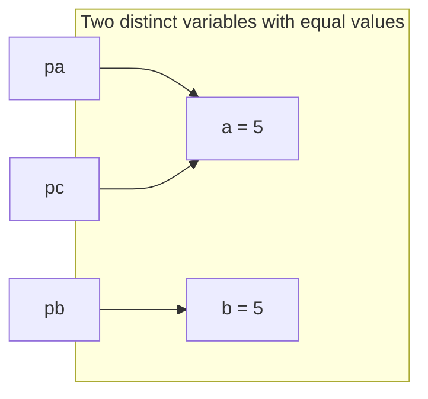

This distinction — comparing _addresses_ (`pa == pb`) versus comparing the _values pointed to_ (`*pa == *pb`) — is a common source of subtle bugs, especially when checking whether "two pointers refer to the same underlying object" is what's actually intended.

## 15. Pointers and Arrays vs. Slices

Go arrays are value types — copying an array copies all of its elements. Because of this, passing a large array to a function by value can be expensive, and a pointer to an array (`*[N]T`) is sometimes used to avoid that copy while still allowing in-place mutation:

```go
func zeroOut(arr *[5]int) {
    for i := range arr {
        arr[i] = 0 // Go automatically dereferences arr for indexing too
    }
}

func main() {
    nums := [5]int{1, 2, 3, 4, 5}
    zeroOut(&nums)
    fmt.Println(nums) // [0 0 0 0 0]
}
```

In practice, this pattern is uncommon in idiomatic Go, because **slices** (which are far more commonly used than fixed-size arrays) already behave the way described in [Section 9](#9-pointers-vs-reference-types-slices-maps-channels) — their internal pointer to the underlying array means you rarely need an explicit `*[]T` just to mutate existing elements. An explicit pointer to an array is mainly relevant when working with genuinely fixed-size arrays (which are less common in everyday Go than slices).

## 16. `new()` vs. `make()`

These two built-in functions are often confused by newcomers because both are involved in "creating" something, but they serve different purposes:

|                                 | `new(T)`                            | `make(T, args...)`                                                                        |
| ------------------------------- | ----------------------------------- | ----------------------------------------------------------------------------------------- |
| Works with                      | Any type                            | Only slices, maps, and channels                                                           |
| Returns                         | A pointer `*T` to a zero-valued `T` | An initialized (non-zero) value of type `T` itself, not a pointer                         |
| Initializes internal structure? | No — just zeroes the memory         | Yes — sets up the slice/map/channel's internal data structures so it's immediately usable |

```go
p := new(int)      // *int, pointing to 0
fmt.Println(*p)     // 0

s := make([]int, 3) // []int, ready to use, length 3
fmt.Println(s)       // [0 0 0]

// new([]int) also compiles, but is unusual: it gives a *[]int pointing to a nil slice,
// which then needs its own initialization (e.g., via append) before real use — make() is
// almost always what you actually want for slices, maps, and channels.
```

**Guidance:** use `make()` whenever you're creating a slice, map, or channel — it's virtually always the right choice for those three types. Use `new()` (or, more commonly, a struct literal with `&`) when you want a pointer to a freshly zero-valued value of any other type, most often a struct.

## 17. `unsafe.Pointer` (Brief Overview)

Go's `unsafe` package provides `unsafe.Pointer`, a special pointer type that can be converted to and from any other pointer type, and to/from `uintptr` (an integer type capable of holding an address), bypassing Go's normal type safety. This is what enables genuinely low-level operations — implementing certain performance-critical data structure tricks, or interfacing with C via cgo — that are otherwise impossible in safe Go.

```go
import "unsafe"

var x int64 = 42
p := unsafe.Pointer(&x)
q := (*int32)(p) // reinterpret the same memory as a different type — dangerous!
```

**This is explicitly outside Go's safety guarantees.** Code using `unsafe.Pointer` can break in ways the compiler and runtime can no longer protect against — including breaking across Go versions, since `unsafe` makes no compatibility promises the way the rest of the language does. It should be reserved for narrow, well-understood, well-tested low-level use cases (parts of the standard library itself use it internally), not general application code. Ordinary Go programs essentially never need it.

## 18. Common Mistakes and Pitfalls

### 18.1 Dereferencing a Nil Pointer

```go
var p *int
fmt.Println(*p) // panic: invalid memory address or nil pointer dereference
```

Always check `p == nil` before dereferencing a pointer that might not have been initialized (see [Section 4](#4-nil-pointer-dereference)).

### 18.2 Returning the Address of a Loop Variable Incorrectly (Pre-Go 1.22)

```go
// BEFORE Go 1.22: classic bug
var pointers []*int
for i := 0; i < 3; i++ {
    pointers = append(pointers, &i) // all pointers ended up pointing to the SAME i
}
// pointers[0], pointers[1], pointers[2] all pointed to the same final value of i
```

Prior to Go 1.22, a `for` loop reused a single variable across iterations, so taking its address repeatedly produced pointers that all referred to the same memory location, holding whatever the loop variable's value was by the time anything actually read through the pointer. Go 1.22 changed loop semantics so each iteration gets its own copy of the loop variable, which fixes this specific case for code using the Go 1.22+ language version — but being explicit (`i := i` inside the loop body) remains good defensive practice, especially in code that must support older Go versions.

### 18.3 Confusing Value Copy with Reference Semantics

```go
func modify(s []int) {
    s = append(s, 99) // may or may not affect the caller, depending on capacity!
}

nums := make([]int, 3, 3) // len=3, cap=3 — no spare capacity
modify(nums)
fmt.Println(nums) // [0 0 0] — the append reallocated a new array; caller's slice header is untouched
```

Because a slice header is copied by value, `append` inside a function may allocate a brand-new underlying array once the original capacity is exceeded — and the caller's slice header (which still points to the old array) never finds out. If a function needs to reliably grow a caller's slice, it must return the new slice and have the caller reassign it (`nums = modify(nums)`), or take a `*[]int` explicitly.

### 18.4 Comparing Pointers When You Meant to Compare Values

```go
type Point struct{ X, Y int }
p1 := &Point{1, 2}
p2 := &Point{1, 2}
fmt.Println(p1 == p2) // false — different addresses, even though the pointed-to values are equal
```

If you want to know whether the _data_ is equal, dereference first (`*p1 == *p2`, for comparable struct types) rather than comparing the pointers themselves.

### 18.5 Overusing Pointers "Just in Case"

Reflexively using a pointer for every parameter or struct field, even small ones that would be cheap to copy, adds unnecessary indirection, increases the chance of accidental `nil` dereferences, and can push more allocations onto the heap than necessary (since a pointer parameter forces escape analysis to consider the value shared). For small, simple types (basic types, small structs with few fields), passing by value is often simpler, safer, and just as fast — reserve pointers for when mutation, large-struct-copy avoidance, or "possibly absent" semantics are actually needed.

### 18.6 Forgetting That Struct Field Access Through a Pointer Is Automatic

```go
type Point struct{ X, Y int }
p := &Point{1, 2}
fmt.Println(p.X) // correct — Go auto-dereferences for field access
// no need to write (*p).X, though it's also valid
```

New Go developers sometimes over-parenthesize (`(*p).X`) out of habit from other languages; while not wrong, it's unnecessary and not idiomatic Go style.

## 19. Best Practices Summary

1. **Use pointers when you need to mutate the caller's data**, avoid copying a large struct, or need a `nil`-capable "optional value" semantic.
2. **Use plain values for small, simple, immutable-in-practice data** — basic types and small structs are usually clearer and just as efficient passed by value.
3. **Always guard against `nil` before dereferencing** a pointer that might not have been initialized or might represent "no value."
4. **Be consistent with receiver types on a given struct** — if one method needs a pointer receiver, use pointer receivers for all of that type's methods.
5. **Don't reach for `*[]T` or `*map[K]V` just to mutate existing elements** — the slice/map's internal pointer already provides that; only use an explicit pointer when the function must reassign the caller's slice/map variable itself.
6. **Let escape analysis do its job** — returning a pointer to a local variable is safe and idiomatic in Go; don't avoid it out of habits carried over from C.
7. **Compare pointers only when you actually mean "same address, same identity"** — dereference first if you mean "equal underlying data."
8. **Avoid `unsafe.Pointer`** in ordinary application code; it forfeits Go's memory-safety and compatibility guarantees.
9. **Use `make()` for slices/maps/channels, and `new()`/`&T{}` for everything else** that needs a fresh pointer.
10. **Use `go build -gcflags="-m"`** when you need to understand or optimize where a specific variable is being allocated (stack vs. heap).

## 20. Use Case Summary Table

| Technique                    | When to Use                                                             | Example Scenario                                                                  |
| ---------------------------- | ----------------------------------------------------------------------- | --------------------------------------------------------------------------------- |
| `&x` / `*p`                  | Get or follow the address of an existing variable                       | Passing a local variable's address into a function that needs to mutate it        |
| `new(T)`                     | Get a pointer to a freshly zero-valued value of a non-container type    | Allocating a pointer to an `int` or struct without a named intermediate variable  |
| Pointer to struct            | Avoid copying a large struct, or allow a function to mutate it          | Passing a large configuration struct into a function that fills in default fields |
| Pointer field in a struct    | Model an "optional"/"not yet set" value distinct from the zero value    | `Timeout *int` — `nil` means "use default," non-nil means "explicitly set"        |
| Pointer receiver on a method | The method must mutate the receiver, or the receiver is large           | `func (c *Counter) Increment()`                                                   |
| Value receiver on a method   | The method never mutates the receiver and the type is small             | `func (p Point) String() string`                                                  |
| Pointer to array (`*[N]T`)   | Avoid copying a large fixed-size array while mutating it in place       | Zeroing out or transforming elements of a large `[N]T` in place                   |
| `**T` (pointer to pointer)   | A function must reassign the caller's pointer variable itself           | Rare; usually better redesigned to return a new pointer                           |
| `unsafe.Pointer`             | Genuinely low-level interop or optimization, outside normal type safety | cgo interop, specific performance-critical standard-library internals             |

## 21. References

1. Go Team — _A Tour of Go: Pointers_. https://go.dev/tour/moretypes/1
2. Go Team — _A Tour of Go: Struct Fields_ and related pages. https://go.dev/tour/moretypes/4
3. Go Language Specification — _Pointer types, Address operators_. https://go.dev/ref/spec#Pointer_types
4. freeCodeCamp — _Learn How to Use Pointers in Go – With Example Code_. https://www.freecodecamp.org/news/learn-how-to-use-pointers-in-go-with-example-code/
5. GeeksforGeeks — _Pointer to a Struct in Golang_. https://www.geeksforgeeks.org/pointer-to-a-struct-in-golang/
6. Programiz — _Go Pointers to Structs (With Examples)_. https://www.programiz.com/golang/pointers-struct
7. Claire Lee — _Golang: Access struct fields_, Medium. https://yuminlee2.medium.com/golang-access-struct-fields-ae320fb74d17
8. Ashwin Gopalsamy — _Go: Pointers & Memory Management_. https://ashwingopalsamy.substack.com/p/go-pointers-and-memory-management
9. The Coding Gopher — _Understanding Go's Escape Analysis_. https://thecodinggopher.substack.com/p/understanding-gos-escape-analysis
10. Md Abu Musa — _Escape Analysis in Go: Stack vs Heap Allocation Explained_, DEV Community. https://dev.to/abstractmusa/escape-analysis-in-go-stack-vs-heap-allocation-explained-506a
11. rogueloop — _Golang Beyond Basics: Escape Analysis_, DEV Community. https://dev.to/rogueloop/golang-beyond-basics-escape-analysis-hc1
12. Harleen (mannharleen) — _Escape analysis in Go Part-1_, DEV Community. https://dev.to/human/escape-analysis-in-go-part-1-42bd
13. GoLand Help — _Escape analysis_. https://www.jetbrains.com/help/go/escape-analysis.html
14. Classmethod (Charu) — _What is the difference between new() and make() in GoLang_. https://dev.classmethod.jp/articles/what-is-the-difference-between-new-and-make-in-golang
15. Leapcell — _make vs new in Go: Differences and Best Practices_, Medium. https://leapcell.medium.com/make-vs-new-in-go-differences-and-best-practices-e11f12d2839f
16. BhanuReddy — _How is new() different in Go?_, DEV Community. https://dev.to/bhanu011/how-is-new-different-in-go-41lk
17. Nitin Bansal — _Using NEW, instead of MAKE, to create slice_, DEV Community. https://dev.to/freakynit/using-new-instead-of-make-to-create-slice-17bl
18. Go standard library documentation — package `unsafe`. https://pkg.go.dev/unsafe
19. Go Team — _Go 1.22 Release Notes_ (for-loop variable scoping change). https://go.dev/doc/go1.22
20. Go Team — _Effective Go_. https://go.dev/doc/effective_go
