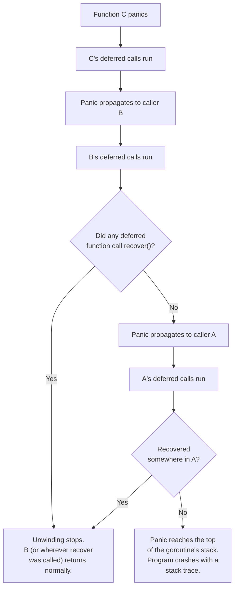

<div align="center">
  <h1>Panic and Recovery</h1>
  <small>
    <strong>Author:</strong> Nguyễn Tấn Phát
  </small> <br />
  <sub>September 18, 2026</sub>
</div>

## Table of Contents

1. [What Is a Panic?](#1-what-is-a-panic)
2. [What Triggers a Panic?](#2-what-triggers-a-panic)
3. [Stack Unwinding: What Happens When a Panic Occurs](#3-stack-unwinding-what-happens-when-a-panic-occurs)
4. [The `panic` Function](#4-the-panic-function)
5. [The `recover` Function](#5-the-recover-function)
6. [Recover Only Works Inside a Deferred Function](#6-recover-only-works-inside-a-deferred-function)
7. [A Complete Recover Example](#7-a-complete-recover-example)
8. [Recovering and Named Return Values](#8-recovering-and-named-return-values)
9. [The Goroutine Boundary: Panics Cannot Cross Goroutines](#9-the-goroutine-boundary-panics-cannot-cross-goroutines)
10. [Re-Panicking](#10-re-panicking)
11. [Panic vs. Error: When to Use Which](#11-panic-vs-error-when-to-use-which)
12. [Panic and Package Boundaries](#12-panic-and-package-boundaries)
13. [Recovering in HTTP Servers and Other Frameworks](#13-recovering-in-http-servers-and-other-frameworks)
14. [Getting a Stack Trace When Recovering](#14-getting-a-stack-trace-when-recovering)
15. [`os.Exit` vs. `panic`](#15-osexit-vs-panic)
16. [`runtime.Goexit`: A Related but Different Mechanism](#16-runtimegoexit-a-related-but-different-mechanism)
17. [Common Mistakes and Pitfalls](#17-common-mistakes-and-pitfalls)
18. [Best Practices Summary](#18-best-practices-summary)
19. [Use Case Summary Table](#19-use-case-summary-table)
20. [References](#20-references)

## 1. What Is a Panic?

A **panic** is a built-in Go mechanism that stops the normal execution of a goroutine. When a panic occurs, the current function stops running immediately, and the goroutine begins **unwinding its call stack** — running any deferred functions along the way — until either something calls `recover()` to stop the unwinding, or the panic reaches the very top of the goroutine's stack, at which point the entire program crashes and prints a stack trace.

Panic and recover behave somewhat like exceptions and try/catch in other languages, but Go's design intentionally makes them feel heavier and rarer to reach for than everyday error handling — ordinary, expected failures should be reported through Go's `error` return-value convention, not through panics. Panics are reserved for situations a program cannot, or should not, continue past normally.

## 2. What Triggers a Panic?

There are two ways a panic can occur:

### 2.1 Runtime Errors (Triggered Automatically by the Go Runtime)

Certain operations are simply invalid at runtime, and the Go runtime itself panics when they happen, rather than letting undefined behavior occur (as might happen in a language like C):

```go
var s []int
_ = s[5] // panic: runtime error: index out of range [5] with length 0

var p *int
_ = *p // panic: runtime error: invalid memory address or nil pointer dereference

a, b := 10, 0
_ = a / b // panic: runtime error: integer divide by zero

var m map[string]int // nil map
m["key"] = 1 // panic: assignment to entry in nil map

var i interface{} = "hello"
_ = i.(int) // panic: interface conversion: interface {} is string, not int
```

### 2.2 Explicit Calls to the Built-in `panic` Function

Code can also trigger a panic deliberately, by calling the built-in `panic` function with any value (commonly a string or an `error`):

```go
func mustPositive(n int) int {
    if n < 0 {
        panic("mustPositive: n must not be negative")
    }
    return n
}
```

## 3. Stack Unwinding: What Happens When a Panic Occurs

When a function panics, the following sequence unfolds:

1. The panicking function's normal execution stops immediately at the point of the panic.
2. Any **deferred function calls already registered in that function** run, in the usual LIFO order, exactly as they would on a normal return.
3. Once those deferred calls finish, the function returns to its caller — but it "returns" as a panic, not a normal return. The caller's execution also stops at the point of the call, and _its_ deferred calls run next.
4. This process repeats up through every enclosing function on the call stack — each one's deferred calls execute, and the panic keeps propagating upward — until either:
   - Some deferred function along the way calls `recover()`, which stops the unwinding and lets execution resume normally from that point onward, or
   - The panic reaches the top of the goroutine's stack without being recovered, at which point the **entire program terminates**, printing the panic's message and a full stack trace to standard error, with an exit status indicating failure.



**Crucial detail:** deferred functions run during unwinding _regardless of whether they recover the panic or not_ — this is exactly why `defer` is the reliable mechanism for cleanup (closing files, unlocking mutexes) even when a function panics, as discussed in depth elsewhere. A deferred cleanup call that doesn't call `recover()` still runs; it simply doesn't stop the panic from continuing to propagate afterward.

## 4. The `panic` Function

`panic` is a built-in function with the signature `func panic(v any)`. It accepts any value — the value passed becomes available to `recover()` later:

```go
panic("something went badly wrong")
panic(fmt.Errorf("unexpected state: %d", state))
panic(42)
```

**Convention:** while `panic` accepts any type, it's idiomatic to pass either a `string` describing what went wrong, or an `error` value (often constructed with `fmt.Errorf` or `errors.New`) — this makes the panic's payload consistent with how the rest of Go's error-reporting conventions work, and makes it easier for any `recover()` site to handle the value meaningfully (e.g., checking `if err, ok := r.(error); ok { ... }`).

## 5. The `recover` Function

`recover` is a built-in function with the signature `func recover() any`. Calling it:

- **During an active panic**, inside a deferred function: stops the unwinding and returns the value that was passed to `panic`.
- **When the goroutine is not currently panicking** (called at any other time): does nothing and returns `nil`.

```go
func safeCall() {
    defer func() {
        if r := recover(); r != nil {
            fmt.Println("recovered from:", r)
        }
    }()
    panic("boom")
}

safeCall()
fmt.Println("execution continues normally after safeCall() returns")
```

Once `recover()` successfully stops a panic, the function containing the deferred `recover()` call returns **normally** to its own caller — the caller has no idea a panic ever happened unless the recovering code explicitly signals it (for example, by setting a named return value, as shown in [Section 8](#8-recovering-and-named-return-values)).

## 6. Recover Only Works Inside a Deferred Function

This is the single most important rule to internalize about `recover`. Calling `recover()` **directly** in ordinary, non-deferred code has no effect, because by the time that code would run, no panic is actually in progress at that point:

```go
func broken() {
    if r := recover(); r != nil { // USELESS: no panic is happening here
        fmt.Println("recovered:", r)
    }
    panic("boom") // this still crashes the program — nothing caught it
}
```

`recover()` must be called **directly inside a function that was deferred** — the only code that actually executes during the unwinding process is the body of deferred functions, so `recover()` only ever has something to catch when invoked from within one of them:

```go
func working() {
    defer func() {
        if r := recover(); r != nil { // CORRECT: called inside a deferred closure
            fmt.Println("recovered:", r)
        }
    }()
    panic("boom") // caught by the deferred closure above
}
```

Calling `recover()` from a function that is itself called _by_ a deferred function (rather than being the deferred function directly) also does not work — the call to `recover()` must be at the top level of the deferred function's own body:

```go
func recoverHelper() {
    recover() // does NOT work — this is one call frame too deep
}

func broken2() {
    defer recoverHelper() // recoverHelper() is deferred, but IT calls recover() from inside itself...
    panic("boom")         // ...which is one level removed from being "directly in the deferred function"
}
```

The safe, idiomatic pattern is always to write the `recover()` call directly inside an anonymous deferred function (or a named function that is itself the direct target of the `defer` statement, with `recover()` as the first thing it does).

## 7. A Complete Recover Example

```go
package main

import "fmt"

func divide(a, b int) (result int, err error) {
    defer func() {
        if r := recover(); r != nil {
            err = fmt.Errorf("recovered from panic: %v", r)
        }
    }()

    result = a / b // panics if b == 0
    return result, nil
}

func main() {
    result, err := divide(10, 2)
    fmt.Println(result, err) // 5 <nil>

    result, err = divide(10, 0)
    fmt.Println(result, err) // 0 recovered from panic: runtime error: integer divide by zero

    fmt.Println("program continues running normally")
}
```

This pattern — converting a potential panic into a normal `error` return — is the most common legitimate use of `recover` in application code: it lets a function present a clean, idiomatic error-based API to its callers, even if its internal implementation (or a library it calls) might panic under some conditions.

## 8. Recovering and Named Return Values

When `recover()` runs inside a deferred closure, the function is already in the process of returning — but if it uses **named return values**, the deferred closure can still set them before the function actually hands control back to its caller (this mirrors how deferred functions interact with named returns generally). Without a named return, there is no way for the recovering code to supply a return value, since the function's normal `return` statement never actually executed:

```go
func foo() (result int) { // named return value: needed so the deferred recover can set it
    defer func() {
        if r := recover(); r != nil {
            fmt.Println("recovered:", r)
            result = -1 // set what foo() ultimately returns, since panic skipped the real return
        }
    }()

    panic("foo: fail")
}

fmt.Println(foo()) // -1
```

If `foo` had used a plain, unnamed `int` return type instead, there would be no variable for the deferred closure to assign to, and the function would simply return its type's zero value (`0`) after recovering, with no way to customize it from within the recovering defer.

## 9. The Goroutine Boundary: Panics Cannot Cross Goroutines

This is one of the most important, and most frequently misunderstood, rules about panic and recover in concurrent Go programs: **a panic can only be recovered by a deferred function running in the very same goroutine where the panic occurred.** A `recover()` call in one goroutine has absolutely no effect on a panic happening in a different goroutine — including the goroutine that launched it.

```go
func main() {
    defer func() {
        if r := recover(); r != nil {
            fmt.Println("recovered in main:", r) // this NEVER runs for the panic below
        }
    }()

    go func() {
        panic("boom in goroutine") // unrecovered — this crashes the ENTIRE PROGRAM
    }()

    time.Sleep(time.Second)
}
```

If a panic reaches the top of a goroutine's own stack without being recovered **within that same goroutine**, the Go runtime terminates the **whole process** — not just that one goroutine — printing a stack trace for all goroutines and exiting with a non-zero status. This means every goroutine you launch that might panic needs its **own** `defer`/`recover` pair, placed directly inside that goroutine's entry function, if you want a panic there to be contained instead of taking down the entire program:

```go
func worker(id int, wg *sync.WaitGroup) {
    defer wg.Done()
    defer func() {
        if r := recover(); r != nil {
            fmt.Printf("worker %d recovered from panic: %v\n", id, r)
        }
    }()

    // ... work that might panic ...
}

var wg sync.WaitGroup
for i := 0; i < 5; i++ {
    wg.Add(1)
    go worker(i, &wg) // each goroutine protects itself independently
}
wg.Wait()
```

**Consequence for third-party code:** if you call into a library that internally launches its own goroutines, and one of those goroutines panics without the library itself recovering internally, there is generally **nothing your own code can do** to prevent the whole program from crashing — the recovery has to happen inside the goroutine where the panic occurs, and you don't control that goroutine's code if it belongs to a dependency.

## 10. Re-Panicking

Sometimes recovery code needs to inspect a panic, take some action (logging, cleanup, metrics), and then **continue propagating** the same panic upward rather than fully suppressing it — this is done by calling `panic()` again with the recovered value, inside the same deferred function:

```go
func withLogging() {
    defer func() {
        if r := recover(); r != nil {
            log.Printf("panic occurred: %v", r)
            panic(r) // re-panic: let it continue propagating after logging it
        }
    }()

    riskyOperation()
}
```

This pattern is useful when you want visibility into a panic (for logging or metrics) at some layer of the program, without actually deciding at that layer whether the program should continue running — that decision is deferred to whatever code further up the stack, if anything, ultimately calls `recover()` without re-panicking.

## 11. Panic vs. Error: When to Use Which

Go's overwhelming convention is to use the `error` return-value mechanism for the vast majority of failure conditions, and reserve `panic` for a much narrower set of circumstances.

| Use `error` for...                                                              | Use `panic` for...                                                                                                                                |
| ------------------------------------------------------------------------------- | ------------------------------------------------------------------------------------------------------------------------------------------------- |
| Expected, recoverable failure conditions that are a normal part of program flow | Situations where the program genuinely cannot continue correctly                                                                                  |
| File not found, network timeout, invalid user input, a record not existing      | Programmer errors and broken invariants (an impossible state, a required precondition violated)                                                   |
| Anything a caller might reasonably want to check and handle explicitly          | Truly exceptional situations where forcing every caller to check an error would be unreasonable overhead for something that "should never happen" |
| Library and package public APIs, almost universally                             | Very rarely, in library code, and generally only for detected programmer misuse, not runtime/environmental conditions                             |

**A useful rule of thumb:** if you can imagine a reasonable caller wanting to catch and handle the failure programmatically (retry, fall back, show a message to the user), it should be an `error`. If the condition represents a bug, a violated invariant, or a state so broken that continuing execution risks corrupting data or producing meaningless results, `panic` is more appropriate.

```go
// Appropriate use of error: a normal, expected failure mode
func ParseAge(s string) (int, error) {
    age, err := strconv.Atoi(s)
    if err != nil {
        return 0, fmt.Errorf("invalid age %q: %w", s, err)
    }
    return age, nil
}

// Appropriate use of panic: an internal invariant that must never be violated
func mustCompileRegex(pattern string) *regexp.Regexp {
    re, err := regexp.Compile(pattern)
    if err != nil {
        panic(fmt.Sprintf("invalid built-in regex pattern %q: %v", pattern, err)) // a hardcoded pattern failing to compile is a programmer bug
    }
    return re
}
```

The last example illustrates a common, legitimate pattern: functions prefixed with **`Must`** (like `regexp.MustCompile` in the standard library) are a documented convention for "this either succeeds, or the program has a bug worth crashing loudly over" — typically used with hardcoded, compile-time-known inputs (like a regex pattern baked into the source code) rather than runtime/user-supplied input, where a normal `error` return would be expected instead.

## 12. Panic and Package Boundaries

By strong convention, **a well-behaved package should not let an explicit `panic()` escape across its own public API boundary** — internal code can use panic/recover freely as an implementation detail, but a package's exported functions should generally convert any internal panics into ordinary `error` return values before returning to the caller, unless panicking really is the documented, intended behavior of that specific function (as with `regexp.MustCompile`).

```go
package parser

func Parse(input string) (result *AST, err error) {
    defer func() {
        if r := recover(); r != nil {
            err = fmt.Errorf("parser: internal error: %v", r) // convert any internal panic into a normal error
        }
    }()

    result = parseInternal(input) // might panic deep inside on malformed input, using panic for control flow internally
    return result, nil
}
```

This pattern is common in parsers and recursive-descent implementations, where using `panic`/`recover` internally to unwind out of deeply nested recursive calls on a fatal parse error can be simpler to implement than manually threading an `error` return through every level of recursion — as long as the panic is caught and converted at the package's public boundary, callers never need to know panic was used internally at all.

## 13. Recovering in HTTP Servers and Other Frameworks

Because a panic in one goroutine crashes the entire program (see [Section 9](#9-the-goroutine-boundary-panics-cannot-cross-goroutines)), and because Go's standard `net/http` server handles each incoming request in its own goroutine, web frameworks and the standard library itself commonly wrap request handlers with a `recover()` so that a single request's panic doesn't take down the server process:

```go
func recoverMiddleware(next http.Handler) http.Handler {
    return http.HandlerFunc(func(w http.ResponseWriter, r *http.Request) {
        defer func() {
            if rec := recover(); rec != nil {
                log.Printf("panic recovered in handler: %v", rec)
                http.Error(w, "Internal Server Error", http.StatusInternalServerError)
            }
        }()
        next.ServeHTTP(w, r)
    })
}
```

Popular Go web frameworks (Gin, Echo, and others) ship an equivalent recovery middleware by default, specifically so that an unexpected panic inside one handler's business logic degrades to a single failed request (typically a 500 response) rather than crashing the whole service and dropping every other in-flight request.

**An important caveat worth being aware of:** applying this same reflexive "wrap every goroutine with a top-level recover" pattern to _every_ goroutine you launch, purely out of habit, is not universally considered best practice by the Go community — some experienced engineers view broad, blanket recovery (especially the standard `net/http` server's own built-in per-request recovery) as something that can mask real bugs and leave a program's state subtly inconsistent, rather than a pattern to imitate everywhere. The safer general guidance is: let an unexpected, truly unanticipated panic crash the program (so the bug gets noticed and fixed), and only add `recover()` in the very specific place you understand, where isolating a failure (like one HTTP request among many) is genuinely more valuable than crashing loudly.

## 14. Getting a Stack Trace When Recovering

`recover()` only returns the panic's payload value — it does **not** hand you a stack trace of where the panic actually originated, unlike the full backtrace Go prints when a panic is left unrecovered. The `runtime/debug` package's `debug.Stack()` function captures a formatted stack trace as a `[]byte`, which is commonly logged alongside the recovered value so you don't lose diagnostic information just because you handled the panic gracefully:

```go
import (
    "log"
    "runtime/debug"
)

func safeHandler() {
    defer func() {
        if r := recover(); r != nil {
            log.Printf("panic: %v\nstack trace:\n%s", r, debug.Stack())
        }
    }()

    riskyOperation()
}
```

Without capturing this, a recovered panic often leaves you with only a single-line message (like `runtime error: invalid memory address or nil pointer dereference`), which is far less useful for debugging than the full call-stack context an unrecovered crash would have printed automatically.

## 15. `os.Exit` vs. `panic`

`os.Exit(code)` and `panic` are both ways for a program to stop, but they behave very differently and serve different purposes:

|                                       | `panic`                                                                                                  | `os.Exit`                                                                                                                 |
| ------------------------------------- | -------------------------------------------------------------------------------------------------------- | ------------------------------------------------------------------------------------------------------------------------- |
| Runs deferred functions?              | Yes — all deferred calls in the unwinding path execute                                                   | **No** — terminates immediately, skipping every deferred call in the entire program                                       |
| Can be intercepted?                   | Yes, via `recover()` in the same goroutine                                                               | No — there's no way to stop or catch an `os.Exit` call                                                                    |
| Typical use                           | Signaling an unrecoverable internal error/invariant violation, with the option for the caller to recover | Deliberately terminating the whole program immediately, usually with a specific exit status, and often only from `main()` |
| Exit status on an uncaught occurrence | Non-zero (typically 2), with a full stack trace printed                                                  | Exactly whatever code you pass, with no additional output unless you print it yourself                                    |

**Practical implication:** because `os.Exit` skips all deferred calls, calling it anywhere that important cleanup (flushing a buffered writer, closing a file, releasing a lock) is deferred will **silently skip that cleanup**. It's generally reserved for `main()`'s own top-level exit logic (or very early, before any meaningful defers have been registered), not for use deep inside application logic where `panic` (if truly warranted) or a normal `error` return (in the overwhelming majority of cases) is the more appropriate tool.

## 16. `runtime.Goexit`: A Related but Different Mechanism

`runtime.Goexit()` terminates the calling goroutine — running all of its deferred functions along the way, just like a panic does — but it is **not** a panic: `recover()` returns `nil` if called from a deferred function during a `Goexit`, since there's no panic value to recover, and `Goexit` never triggers a crash or propagates any error-like value. It's a fairly specialized, rarely used tool — mostly relevant in testing frameworks (this is roughly how `testing.T.FailNow()` and `t.Fatal` are implemented internally, to stop the current test goroutine cleanly while still running its deferred cleanup) rather than something typical application code reaches for directly.

## 17. Common Mistakes and Pitfalls

### 17.1 Calling `recover()` Outside a Deferred Function

```go
func broken() {
    recover() // does nothing — no panic is in progress here, and this isn't even a defer
    panic("boom")
}
```

`recover()` only has an effect when called directly inside a deferred function during an active panic — see [Section 6](#6-recover-only-works-inside-a-deferred-function).

### 17.2 Assuming Recover Works Across Goroutines

```go
defer func() { recover() }() // in main()
go doWork()                   // if doWork() panics, this recover does NOT catch it
```

Every goroutine that might panic needs its own `defer`/`recover`, placed inside that specific goroutine's own entry function — see [Section 9](#9-the-goroutine-boundary-panics-cannot-cross-goroutines).

### 17.3 Overusing Panic for Ordinary, Expected Failures

```go
func GetUser(id string) *User {
    user, ok := db[id]
    if !ok {
        panic("user not found") // BAD: this is an entirely expected, everyday condition
    }
    return user
}
```

"Not found" is a routine, expected outcome in most applications — it should be an `error` return (or perhaps a `(User, bool)` pair), not a panic, so callers can handle it gracefully without needing a `recover()` for something that isn't exceptional at all.

### 17.4 Forgetting Named Return Values When Recovering

```go
func compute() int { // no named return
    defer func() {
        if r := recover(); r != nil {
            // no way to customize what compute() returns here — it'll just be the zero value, 0
        }
    }()
    panic("boom")
}
```

If you need the recovering code to influence the function's return value, the function must declare a **named** return value, as shown in [Section 8](#8-recovering-and-named-return-values).

### 17.5 Silently Swallowing Panics Without Logging

```go
defer func() {
    recover() // panic is completely discarded — no logging, no metrics, nothing
}()
```

Recovering without at least logging the panic's value (and ideally a stack trace, per [Section 14](#14-getting-a-stack-trace-when-recovering)) hides real bugs from anyone monitoring the system, turning a loud, visible crash into a silent, invisible failure that might leave the program in an inconsistent state without anyone noticing.

### 17.6 Using `os.Exit` Where Deferred Cleanup Matters

```go
func main() {
    f, _ := os.Create("output.txt")
    defer f.Close() // never runs!
    if somethingWrong {
        os.Exit(1) // skips the deferred Close() above entirely
    }
    // ...
}
```

Remember that `os.Exit` bypasses every deferred call in the program — if cleanup matters, structure the program so `os.Exit` is only called after that cleanup has already happened (or isn't needed), typically right at the very end of `main`.

### 17.7 Letting Explicit Panics Cross a Public API Boundary Unintentionally

```go
package mathutil

func Divide(a, b int) int {
    return a / b // panics on b == 0 — and this propagates straight out to any caller, undocumented
}
```

If a public function can panic under conditions a caller might reasonably encounter (like a zero divisor from user input), that's usually a sign it should return an `error` instead — unless the panicking behavior is a clearly documented, intentional part of the function's contract (as with a `Must`-prefixed function).

## 18. Best Practices Summary

1. **Use `error` for the overwhelming majority of failure conditions** — reserve `panic` for programmer errors, broken invariants, and situations where continuing execution genuinely isn't safe or meaningful.
2. **Always place `recover()` directly inside a deferred function** — it has no effect anywhere else.
3. **Remember panics cannot cross goroutine boundaries** — give every goroutine that might panic its own `defer`/`recover`, placed at that goroutine's own entry point.
4. **Use a named return value when a deferred recover needs to influence what the function returns.**
5. **Log the recovered value (and ideally a stack trace via `runtime/debug.Stack()`)** — never silently swallow a panic without at least recording that it happened.
6. **Convert internal panics to ordinary errors at a package's public API boundary**, unless the panicking behavior is a documented, intentional part of a function's contract (like a `Must`-prefixed constructor).
7. **Don't reflexively wrap every goroutine in a top-level recover out of habit** — understand specifically why isolating a given failure (e.g., one HTTP request among many) is worth the risk of masking a real bug, rather than applying it everywhere by default.
8. **Never rely on `os.Exit` where deferred cleanup matters** — it skips every deferred call in the program; call it only after any necessary cleanup has already happened, typically at the very end of `main`.
9. **Re-panic (rather than fully suppressing) when you only want to observe a panic (log it, record metrics) without deciding whether the program should actually continue.**
10. **Reserve explicit `panic()` calls in your own code for truly exceptional, "this should never happen" situations** — and prefer well-known, documented conventions like `Must`-prefixed function names when a function's intended contract is "either succeeds, or the program has a bug."

## 19. Use Case Summary Table

| Technique                                             | When to Use                                                                               | Example Scenario                                                                    |
| ----------------------------------------------------- | ----------------------------------------------------------------------------------------- | ----------------------------------------------------------------------------------- |
| `error` return value                                  | Any expected, recoverable failure condition                                               | Invalid input, file not found, network timeout                                      |
| Explicit `panic()`                                    | A broken invariant / programmer error the program should not continue past                | An internal state that should be logically impossible                               |
| `Must`-prefixed function + panic                      | A function whose failure represents a hardcoded/compile-time bug, not a runtime condition | `regexp.MustCompile`, a package-level `init()`-time setup helper                    |
| `defer` + `recover()` converting panic to error       | A package's public API should never let an internal panic escape as a raw panic           | A parser using panic internally for control flow, recovered at `Parse()`'s boundary |
| `defer` + `recover()` in a goroutine's entry function | Prevent one goroutine's panic from crashing the entire program                            | Worker goroutines in a pool, background jobs, HTTP request handlers                 |
| Re-panicking after logging                            | Observe/record a panic without deciding whether the program should continue               | Middleware that logs a panic's details before letting it propagate further          |
| `runtime/debug.Stack()` in a recover handler          | Preserve debugging context that `recover()` alone doesn't provide                         | Logging a full stack trace alongside a recovered panic in a server                  |
| `os.Exit`                                             | Deliberately terminating the whole program immediately, typically from `main()`           | A CLI tool exiting with a specific status code after all cleanup is already done    |

## 20. References

1. Go Team — _Defer, Panic, and Recover_, The Go Blog. https://go.dev/blog/defer-panic-and-recover
2. Go Team — _Go Wiki: PanicAndRecover_. https://go.dev/wiki/PanicAndRecover
3. Go standard library documentation — built-in functions `panic` and `recover`. https://pkg.go.dev/builtin#panic
4. Go standard library documentation — package `runtime` (`Goexit`). https://pkg.go.dev/runtime#Goexit
5. Go standard library documentation — package `runtime/debug` (`Stack`). https://pkg.go.dev/runtime/debug#Stack
6. YourBasic Go — _Panics, stack traces and how to recover [best practice]_. https://yourbasic.org/golang/recover-from-panic/
7. Sogol Hedayatmanesh — _Crash-Proof Go Services: Why You Must Recover Panics in Goroutines (Whether You Like It or Not)_, Medium. https://medium.com/@sogol.hedayatmanesh/crash-proof-go-services-why-you-must-recover-panics-in-goroutines-whether-you-like-it-or-not-4c2bbecfd191
8. devtrovert — _Go Panic & Recover: Don't Make These Mistakes_. https://blog.devtrovert.com/p/go-panic-and-recover-dont-make-these
9. Eternal Night — _Panic capture and recovery mechanisms for goroutine in Go language_. https://www.shuijingwanwq.com/en/2026/05/22/12901/
10. TechieLearn — _Panic and Recover in Go: Handling Fatal Errors_. https://techielearn.com/tutorials/golang-programming/error-handling/panic-and-recover
11. sergerad — _Panic, Recover and Relax_, DEV Community. https://dev.to/sergerad/panic-recover-and-relax-158
12. wambita_sheila_fana — _Don't Panic: Handle Errors Gracefully with Panic, Defer, and Recover in Go_, DEV Community. https://dev.to/wambita_sheila_fana/dont-panic-handle-errors-gracefully-with-panic-defer-and-recover-in-go-57hb
13. golang/go Issue #76763 — discussion on `net/http`'s built-in panic recovery not being a recommended pattern to imitate. https://github.com/golang/go/issues/76763
14. Go standard library documentation — package `regexp` (`MustCompile` convention). https://pkg.go.dev/regexp#MustCompile
15. Go standard library documentation — package `testing` (`T.Fatal`/`FailNow`, related to `runtime.Goexit`). https://pkg.go.dev/testing
